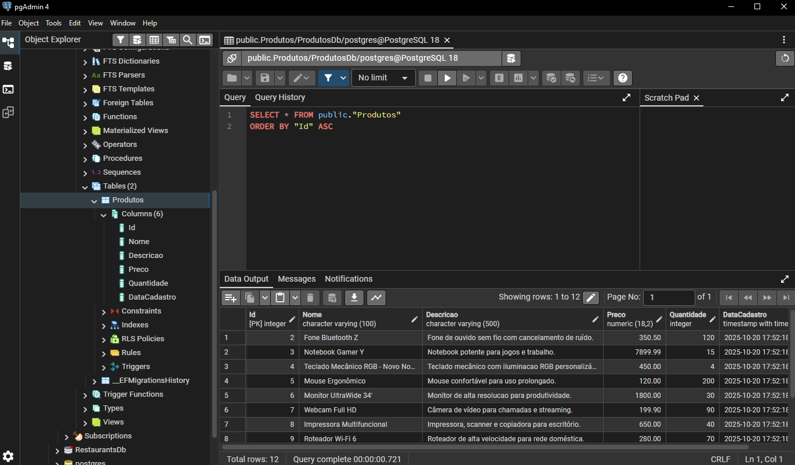
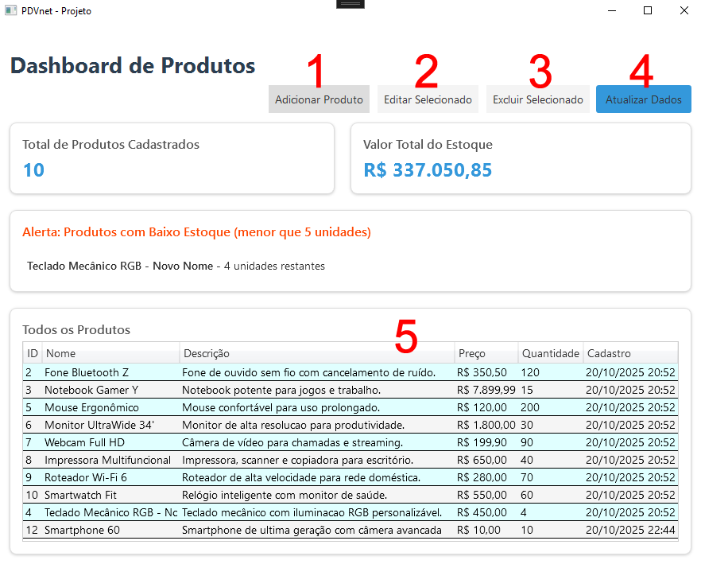

## .NET 9 WPF com ASP.NET WEB API em Clean Architecture

Este projeto é um sistema de gestão de produtos, feito em .NET 9. Ele tem um backend em ASP.NET Web API seguindo os princípios de Clean Architecture e um front em WPF.

## Estrutura do Projeto

### PDVnet.GestaoProdutos.Backend

Aqui fica o backend da aplicação, uma API feita em ASP.NET Web API.

-   **Arquitetura:** A estruturação do projeto foi feita em Clean Architecture, pra separar bem as responsabilidades.
-   **ORM:** Usei o Entity Framework pra fazer o mapeamento objeto-relacional.
-   **Banco de Dados:** O banco de dados é o PostgreSQL.

### PDVnet.GestaoProdutos.FrontEnd

Esta é a aplicação desktop, desenvolvida com C# e WPF.

**Pra nao deixar as pastas bin e obj espalhadas por cada projeto, eu adicionei um arquivo Directory.Build.props na raiz da solução.

---

## Como rodar o projeto

**Importante:** Antes de qualquer coisa, você precisa iniciar o projeto `PDVnet.GestaoProdutos.Backend` pra que o frontend consiga acessar a API.

### 1. Configuração do Banco de Dados

Você vai precisar ajustar a string de conexão no `appsettings.json`/`appsettings.Development.json` do projeto da API.

-   **Arquivo:** `src/PDVnet.GestaoProdutos.API/appsettings.Development.json`
-   **Propriedade:** `ConnectionStrings`

Troque pelos dados do seu banco SQL. Exemplo:

```json
{
  "ConnectionStrings": {
    "ProdutosDb": "Host=localhost;Database=ProdutosDb;Username={SEU-USUARIO};Password={SUA-SENHA}"
  },
  "Logging": {
    "LogLevel": {
      "Default": "Information",
      "Microsoft.AspNetCore": "Warning"
    }
  }
}
```

### 2. Migrations e criação do banco

Pra criar as tabelas e o banco de dados, siga esses passos:

1.  No Visual Studio 2022, clique com o botão direito no projeto `PDVnet.GestaoProdutos.API` e selecione "Set as Startup Project".
2.  Vá em **Tools -> NuGet Package Manager -> Package Manager Console**.
3.  Na janela do console, verifique se o "Default project" é o `PDVnet.GestaoProdutos.Infrastructure`.
4.  Execute o comando pra criar a migration:
    ```bash
    add-migration Init
    ```
5.  Depois, pra aplicar a migration e criar o banco, rode:
    ```bash
    update-database
    ```

---

## Requisitos da Aplicação

1. Cadastrar novos produtos com os seguintes campos
* Nome (obrigatório)
* Descrição
* Preço (obrigatório)
* Quantidade em estoque (obrigatório)
2. Listar todos os produtos cadastrados em uma grade ou lista
3. Editar as informações de um produto existente
4. Excluir um produto do sistema

### Regras de Negócio

1. O `Nome`, `Preço` e `Quantidade` de um produto são campos obrigatórios.
2. O `Preço` e a `Quantidade` não podem ser valores negativos.
3. A data de cadastro deve ser gerada automaticamente no momento da criação do produto.

#### postgresql, registros de produtos gravados diretamente no banco de dados



#### A interface principal da aplicação de gestão de produtos


**(1)** Adicionar Produto: Abre a janela para cadastrar um novo produto.
**(2)** Editar Produto Selecionado: Habilitado apenas quando um produto é selecionado no grid **(5)**, permite editar o item.
**(3)** Excluir Produto Selecionado: Também habilitado com a seleção de um produto, remove o item do banco.
**(4)** Atualizar: Recarrega a lista de produtos, buscando os dados mais recentes da API.
**(5)** DataGrid: Exibe a lista de todos os produtos. A seleção de um item nesta grade é o que ativa os botões de edição **(2)** e exclusão **(3)**.